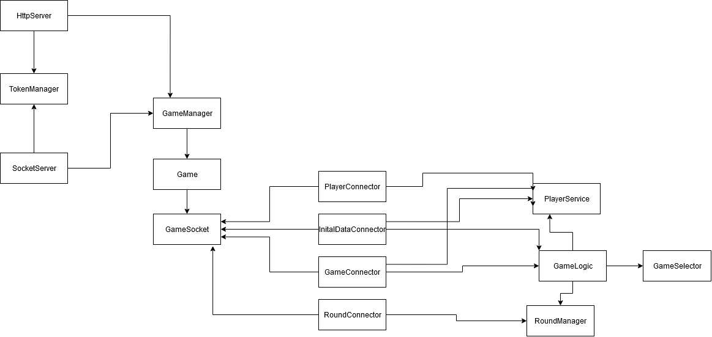
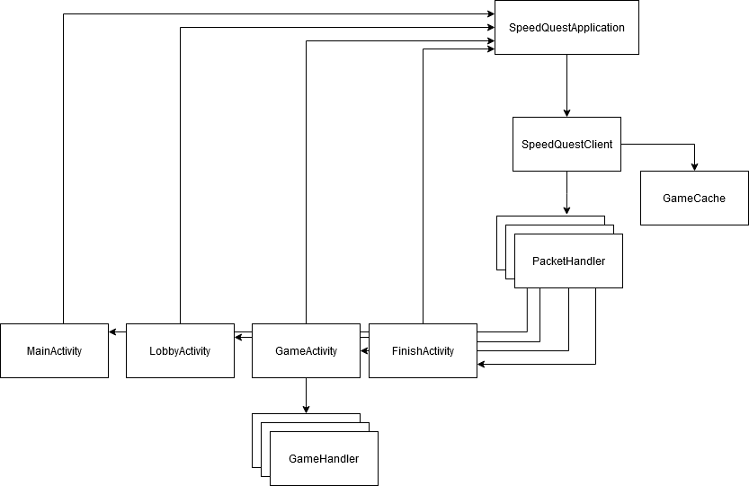

# SpeedQuestAndroid

## What is SpeedQuest?

SpeedQuest is a collection of mini-games. It is an online competition between players in a lobby, where players get rated by their performance.

## Architecture

SpeedQuest uses a simple Client-Server architecture. The server assigns tasks and keeps track of each player's score. It enables the client to broadcast custom packets, send information and receive real-time updates. Minigames get rated client-side, whereas the server processes those ratings and translates them into a specific score.

### Server Architecture

The SpeedQuest server is a NodeJS-server that uses WebSocket. The repository can be found [here](https://github.com/Jaybit0/SpeedQuest).

### App Architecture

## Communication

The app communicates via WebSocket and Json-Packets.

## Dependencies

[AndroidAsync:2.2.1](https://github.com/koush/AndroidAsync)
